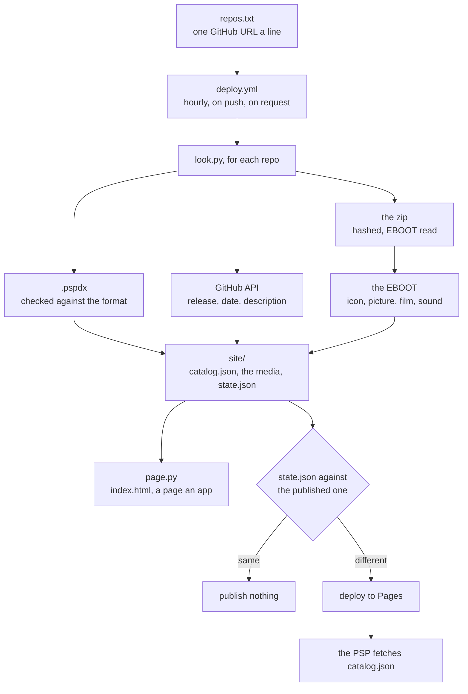

# PSPDX catalog

The list of PSP homebrew [PSPDX](https://github.com/chriopter/pspdx) shows
on the console. View it here: https://chriopter.github.io/pspdx-catalog/

To list an app, add a `.pspdx` to its repository and open an issue here.
See [pspdx-demo](https://github.com/chriopter/pspdx-demo) for an example.

## Every file here

- [`repos.txt`](repos.txt) is the list. One repo a line, `@tag` to freeze one at a release.
- [`.github/workflows/deploy.yml`](.github/workflows/deploy.yml) runs it hourly, on a push and on request.
- [`.github/look.py`](.github/look.py) reads the repos and writes the site.
- [`.github/page.py`](.github/page.py) builds the pages, the style and the wave.

## Catalog site structure

Built every time, committed never.

- `catalog.json` is every app with its release, so the PSP asks once.
- `index.html` and one page an app, for whoever has no PSP.
- `icons/ shots/ vids/ snd/` hold the media out of each EBOOT.
- `state.json` is what the last run saw, so the next one can tell.

## How a run works

