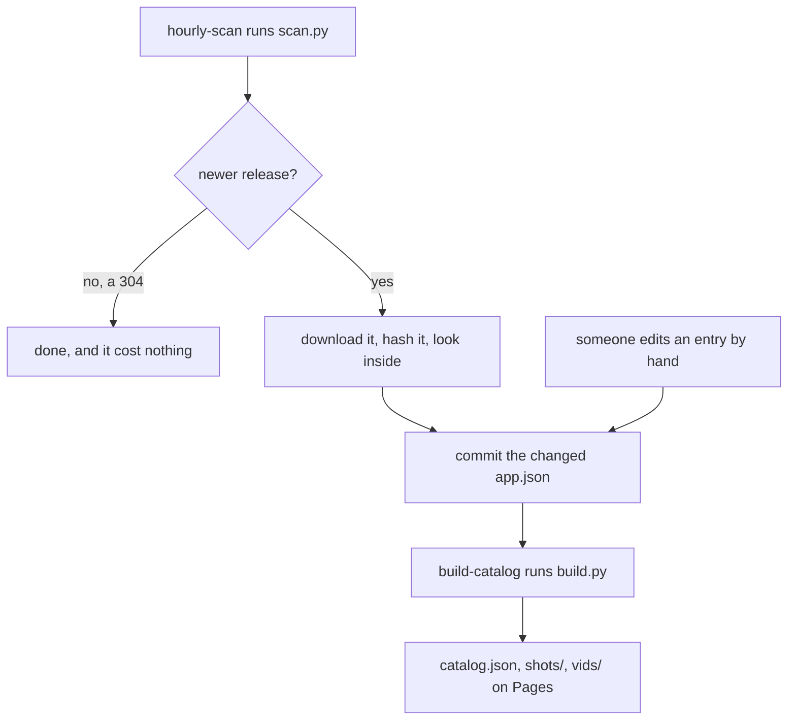

# PSPDX catalog

The catalog [PSPDX](https://github.com/chriopter/pspdx) fetches: one directory
per app, folded into a single
[catalog.json](https://chriopter.github.io/pspdx-catalog/catalog.json) and
served from Pages.

What the fields mean, and why any of it is shaped this way, lives in the
[main repository](https://github.com/chriopter/pspdx).

## Currently listed apps

| | | |
|---|---|---|
| **[Abandoned Test App](https://github.com/chriopter/psp-dx-testapp-abandoned)** | apps · MIT | 1 |
| **[Extreme Tux Racer](https://github.com/chriopter/psp-tuxracer)** | games · GPL-2.0 | 0.21.0 |
| **[PSPDX Test App](https://github.com/chriopter/psp-dx-testapp)** | apps · MIT | 2 |
| **[Rust Raytracer](https://github.com/chriopter/psp-rust-raytracer)** | demos · MIT | 0.1.0 |

Maintained by hand for now; the versions come from the last scan.

## Getting in

- **To have an app listed** — open a pull request adding `apps/<id>/app.json`,
  or open an issue and ask. Open source licences only.
- **To have a release picked up now** rather than within the hour — open an
  issue titled `rescan: <repo url>`.

## How a release gets here

`scan.py` reads releases, never repositories. It rewrites `release` and
`archive` and nothing else — name, summary, category and licence stay as a
person wrote them. Nothing is built unless something was committed.

## An app bundle

One directory per app, named exactly after the `id` inside it. Here is
[a whole one](apps/io.github.chriopter.rustraytracer).

| | |
|---|---|
| [`app.json`](apps/io.github.chriopter.rustraytracer/app.json) | The entry. Half by hand, half by `scan.py`. |
| `icon.png` | 144x80, out of the EBOOT. Optional. |
| [`screenshot.png`](apps/io.github.chriopter.rustraytracer/screenshot.png) | 480x272 still. Optional. |
| [`video.mp4`](apps/io.github.chriopter.rustraytracer/video.mp4) | Ten seconds of H.264 baseline. Optional. |

## The machinery

| | |
|---|---|
| [`scan.py`](scan.py) | Reads the newest release, hashes it, looks inside. |
| [`build.py`](build.py) | Folds every entry into one `catalog.json`. |
| [`hourly-scan.yml`](.github/workflows/hourly-scan.yml) | Runs the scan hourly, commits, deploys. |
| [`trigger-scan.yml`](.github/workflows/trigger-scan.yml) | Scans one repository when an issue asks. |
| [`build-catalog.yml`](.github/workflows/build-catalog.yml) | Builds the site and publishes it. |

No binaries live here. Those stay in their authors' releases.
